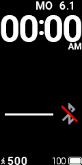
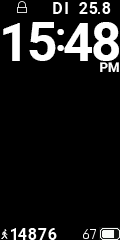

# Band4-WF-Xdrip-German

First of all a big thanks to BigDigital! He created the initial layout for this watchface and provides the Miband support for xdrip! https://bigdigital.home.blog

--> EN  (DE steht unten)

1. Download all files in "MiBand 4 Xdrip WF GER"
2. The custom watchface files ‘my_watchface.bin’ and ‘my_image.png’ should be placed into into ‘xdrip’ folder on your phone. “my_watchface.bin” is a normal watchface and my_image.png is a watchface background image. 
3. activate in miband Settings of Xdrip

Things i Changed:
- raised the size of steps, date, week
- changed the week days to german format

No worries, the am/pm funktionality is not visible

--> DE

Kurzfassung in Deutsch:

hier ein custom watchface für bigdigitals Miband Support für xdrip (https://bigdigital.home.blog).
Angepasst habe ich:
- Datum/Wochentage in DE
- Schritte, Wochentage und Datum vergrößert.

Einfach die files aus "MiBand 4 Xdrip WF GER" runterladen, auf dem telefon in den xdrip ordner machen und in xdrip in den mibandeinstellungen aktivieren.
